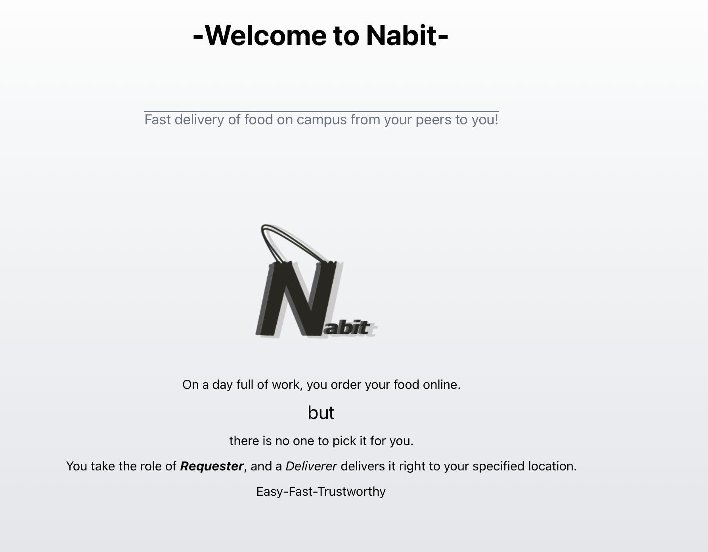

# Nabit — Campus Food Delivery



A peer-to-peer food delivery app for Montclair State University. Students who already ordered food online can post their order for a fellow student to pick up and deliver to their location on campus.

---

## What It Does

Nabit has two roles:

**Requester** — Already placed an online order at a campus restaurant? Post it on Nabit with your confirmation number, delivery location, and a tip amount. A deliverer will pick it up and bring it to you.

**Deliverer** — Browse open requests from other students. Accept one, pick it up from the restaurant, and deliver it to the drop-off spot to earn the tip.

Both dashboards update in real time without page refreshes. A progress bar tracks the order from pending → accepted → picked up → delivered.

---

## Tech Stack

| Layer | Technology |
|---|---|
| Framework | Next.js 16 (App Router) |
| Auth | better-auth with Google OAuth |
| Database | PostgreSQL (Neon, pooled) |
| Styling | Tailwind CSS v4 + MUI |
| Data Fetching | SWR (polling every 3s) |
| Server Logic | Next.js Server Actions |
| Hosting | Vercel (target) |

---

## Architecture

```
src/
├── app/
│   ├── (protected)/          # Route group — guarded by layout session check
│   │   ├── dashboard/        # Role-based dashboard (requester or deliverer)
│   │   ├── onboarding/       # First-time role selection
│   │   └── role-switcher/    # Toggle between requester and deliverer
│   ├── api/
│   │   ├── auth/[...all]/    # better-auth handler
│   │   ├── requests/
│   │   │   ├── pending/      # GET all open requests (deliverer view)
│   │   │   └── [userId]/active/ # GET active order for a deliverer
│   │   └── users/[userId]/requests/ # GET active orders for a requester
│   ├── actions.js            # Server Actions: setRole, addRequest, cancelRequest, acceptRequest, updateStatus
│   ├── campus-data.js        # Static data: restaurants, locations, coordinates
│   ├── db.js                 # pg Pool singleton
│   └── utils.js              # SWR fetcher helper
├── auth.js                   # better-auth config (Google OAuth, custom user fields)
├── auth-client.js            # Client-side auth helpers (signIn, signOut, refreshSession)
└── components/
    ├── Login.jsx
    ├── Logout.jsx
    ├── RoleSwitcher.jsx
    ├── deliverer/
    │   └── DelivererDashboard.jsx
    └── requester/
        ├── RequesterDashboard.jsx
        └── ProgressBar.jsx
```

---

## Key Features

**Role-based session system.** Each user has an `activeRole` field (`requester` or `deliverer`) and an `onboardingComplete` flag stored in the database. The protected layout reads the session on every request and redirects accordingly. First-time users are sent to onboarding before reaching the dashboard.

**Server Actions for all writes.** Order creation, cancellation, acceptance, and status updates all go through Next.js Server Actions directly against PostgreSQL. No separate REST endpoints for mutations.

**SWR polling for real-time state.** Both dashboards poll their respective endpoints every 3 seconds using SWR. The deliverer dashboard watches for pending requests and their own active order simultaneously. The requester dashboard stops polling once the order is delivered to avoid unnecessary requests.

**Order state machine.** Orders move through five statuses: `pending → accepted → picked_up → delivered → cancelled`. Each status renders a different UI for both the requester and the deliverer.

**Campus data.** Hardcoded restaurant list, drop-off locations, and lat/lng coordinates for all Montclair State buildings and restaurants are centralized in `campus-data.js`.

---

## Database Schema

```sql
-- better-auth managed tables
CREATE TABLE "user" (
  id TEXT PRIMARY KEY,
  name TEXT NOT NULL,
  email TEXT NOT NULL UNIQUE,
  "emailVerified" BOOLEAN NOT NULL,
  "activeRole" TEXT,
  "onboardingComplete" BOOLEAN DEFAULT false,
  "createdAt" TIMESTAMPTZ DEFAULT NOW(),
  "updatedAt" TIMESTAMPTZ DEFAULT NOW()
);

CREATE TABLE session ( ... );
CREATE TABLE account ( ... );
CREATE TABLE verification ( ... );

-- App table
CREATE TABLE requests (
  id SERIAL PRIMARY KEY,
  restaurant TEXT NOT NULL,
  drop_off_spot TEXT NOT NULL,
  delivery_contents TEXT NOT NULL,
  confirmation_number TEXT NOT NULL,
  room_floor TEXT,
  tip_amount NUMERIC NOT NULL,
  requested_by TEXT REFERENCES "user"(id),
  accepted_by TEXT REFERENCES "user"(id),
  status TEXT DEFAULT 'pending',
  created_at TIMESTAMPTZ DEFAULT NOW()
);
```

---

## Local Setup

```bash
git clone https://github.com/YOUR_USERNAME/nabit.git
cd nabit
npm install
```

Create a `.env.local` file:

```env
DATABASE_URL=your_neon_connection_string
BETTER_AUTH_URL=http://localhost:3000
BETTER_AUTH_SECRET=your_secret_here
GOOGLE_CLIENT_ID=your_google_client_id
GOOGLE_CLIENT_SECRET=your_google_client_secret
```

Run the dev server:

```bash
npm run dev
```

Open [http://localhost:3000](http://localhost:3000).

---

## Auth Flow

1. User lands on `/sign-in` and clicks "Sign in with Google."
2. better-auth handles the OAuth callback and creates or retrieves the user record.
3. If `onboardingComplete` is false, the user is redirected to `/onboarding` to choose a role.
4. After choosing, `activeRole` and `onboardingComplete` are written to the database via a Server Action.
5. All subsequent requests to `/(protected)/*` check the session in the layout. No session means redirect to `/sign-in`.

---

## What I Built

This is a solo project. I designed the database schema, set up the auth layer with better-auth and Google OAuth, built all the server actions and API routes, implemented the SWR real-time polling, and wrote both the requester and deliverer dashboards. The bug fixes throughout the codebase (noted inline) reflect real debugging work done during development.

---

## Status

In active development. Core order flow is functional. Planned additions include a map view using the coordinates already in `campus-data.js`, push notifications, and order history.
